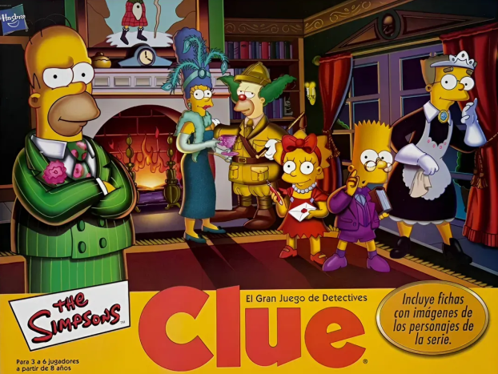

# 🍩 Anotador Clue: Los Simpson

Un anotador digital e inteligente para el juego de mesa **Clue: Los Simpson** (Hasbro / Toy Company). Diseñado para reemplazar la hoja de papel tradicional, automatizar deducciones y mantener la privacidad de tus notas durante la partida.

---

## 🚀 Características Principales

* 🔒 **Pantalla de Bloqueo de Privacidad:** Bloqueá la pantalla con un solo toque mostrando la caja oficial del juego para evitar que otros jugadores miren tus notas.
* 🎴 **Marcador de Mano Inicial:** Seleccioná rápidamente las cartas que te tocaron al empezar para tacharlas automáticamente en las columnas de tus rivales.
* 🧠 **Deducción Automática e Inteligente:**
  * Al confirmar una carta para un jugador (✔️), coloca cruces (❌) al resto.
  * Autodescarta celdas cuando un jugador alcanza el límite total de cartas asignadas según la cantidad de participantes (3 a 6 jugadores).
  * Detecta si nadie tiene una carta para asignarla directamente al **Sobre Confidencial**.
* 📜 **Historial de Suposiciones:** Registrá quién sospechó de qué combinación, qué jugadores pasaron y quién mostró una carta.
* ✉️ **Gestión del Sobre Confidencial:** Modál dedicado para registrar o autodeducir al asesino, arma y lugar.
* ↩️ **Función Deshacer (Undo):** Sistema de historial que permite revertir cambios si marcás una celda por error.
* 📤 **Guardado y Compartido:** Exportá el estado de la partida mediante un código de texto o envialo directo por WhatsApp para restaurarlo en otro dispositivo.
* 📖 **Reglas Integradas:** Reglamento oficial de la edición de Los Simpson accesible en cualquier momento.
* 📱 **Diseño Responsive:** Funciona directo en el navegador de cualquier celular, tablet o PC sin instalar nada.

---

## 🛠️ Tecnologías

* **HTML5 & JavaScript ES6+** (Vanilla JS, sin frameworks externos).
* **Tailwind CSS** (vía CDN para interfaz y diseño adaptativo).
* **LocalStorage API** (Para guardar el estado de la partida automáticamente en el navegador).

