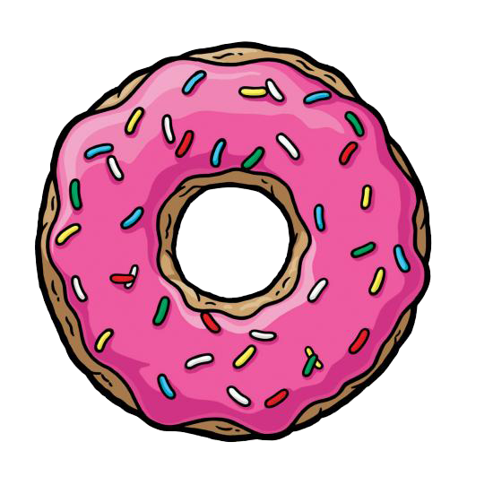

<h1 align="center">
  
  Anotador Clue: Los Simpson
  
</h1>
---

Anotador digital para la edición **Clue: Los Simpsons** de Hasbro, pensado para jugar sin papel ni lápiz. Funciona como una web app de una sola página, sin instalación ni conexión a internet requerida durante el juego.

🔗 **Online:** [javierquero.github.io/ClueSimpsons](https://javierquero.github.io/ClueSimpsons/)

---

## ✨ Funcionalidades

- **Tabla de anotaciones** con todas las cartas del juego (sospechosos, armas y lugares), organizada por categoría y colapsable por sección
- **Ciclo de estados por celda** al tocar/hacer clic: Sin marcar → ❌ No tiene → ✔️ Tiene → Notas 1–5 → 👁️ Observado
- **Registro de mano inicial** (Mis Cartas): selección de cartas propias al inicio, que se bloquea automáticamente y propaga cruces al resto de jugadores
- **Sobre Confidencial**: se actualiza automáticamente cuando por descarte lógico se puede determinar qué carta está en el sobre. Muestra animación y sonido al resolver el caso
- **Modal de Suposición**: registro de cada suposición con respuesta por jugador (pasó / mostró carta), con actualización automática de la tabla
- **Historial de suposiciones**: registro cronológico de todas las suposiciones realizadas durante la partida
- **Pantalla de bloqueo**: oculta el anotador con imagen de la caja del juego para cuando otro jugador mira la pantalla
- **Persistencia local**: el estado del juego se guarda automáticamente en `localStorage` y sobrevive recarga de página
- **Soporte de 3 a 6 jugadores** con nombres editables directamente en la tabla
- **Reglas del juego** integradas en la app

---

## 📱 Diseño Responsive

### Mobile
- Bottom navigation fija con acceso rápido a todas las acciones
- Modales como **bottom sheets** que suben desde abajo
- Tabla compacta con columna de cartas fija (sticky)
- Zoom deshabilitado para evitar saltos al enfocar inputs

### Desktop
- Header con todos los botones en la parte superior
- Tabla amplia con nombres de jugadores editables inline

---

## 🃏 Cartas del juego

| Categoría     | Cartas |
|---------------|--------|
| Sospechosos   | Srita. Escarlata, Sra. Blanco, Profesor Moradillo, Coronel Mostaza, Sra. Azulino, Sr. Verdi |
| Armas         | Collar, Honda, Saxofón, Guante extensible, Barra de Plutonio, Dona envenenada |
| Lugares       | Kwik-E-Mart, El Calabozo del Androide, Asilo Springfield, Bolerama, Mansión Burns, Estudios Krustylu, Casa de los Simpsons, El Holandés Frito, Planta Nuclear |

---

## 🗂️ Archivos del proyecto

```
ClueSimpsons/
├── index.html                  # App completa (HTML + CSS + JS en un solo archivo)
├── dona.png                    # Ícono de dona (favicon y logo)
├── caja-clue-simpsons.png      # Imagen de la caja (pantalla de bloqueo)
├── Homer_Simpson_Revised.ttf   # Fuente temática del header
└── README.md
```

---

## 🚀 Uso

Al ser un archivo estático, no requiere servidor ni dependencias externas más allá de Tailwind CSS (cargado desde CDN). Para usar localmente, basta con abrir `index.html` en cualquier navegador moderno.

Para desplegarlo en GitHub Pages, simplemente pusheá los archivos a la rama principal del repositorio y activá Pages desde la configuración del repo.

---

## 🛠️ Tecnologías

- HTML5 + CSS3 + JavaScript vanilla
- [Tailwind CSS](https://tailwindcss.com/) (via CDN)
- `localStorage` para persistencia del estado
- Web Audio API para el sonido de caso resuelto

---

## 📄 Licencia del juego

Clue: Los Simpsons © 2005 Hasbro Internacional Inc. / Twentieth Century Fox Film Corporation.  
Fabricado bajo licencia por Toy Company S.R.L. — Buenos Aires, Argentina.  
Este proyecto es un anotador digital no oficial, sin fines comerciales.
